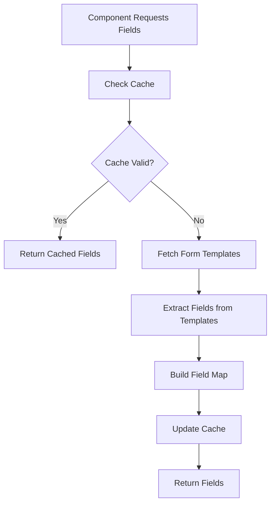
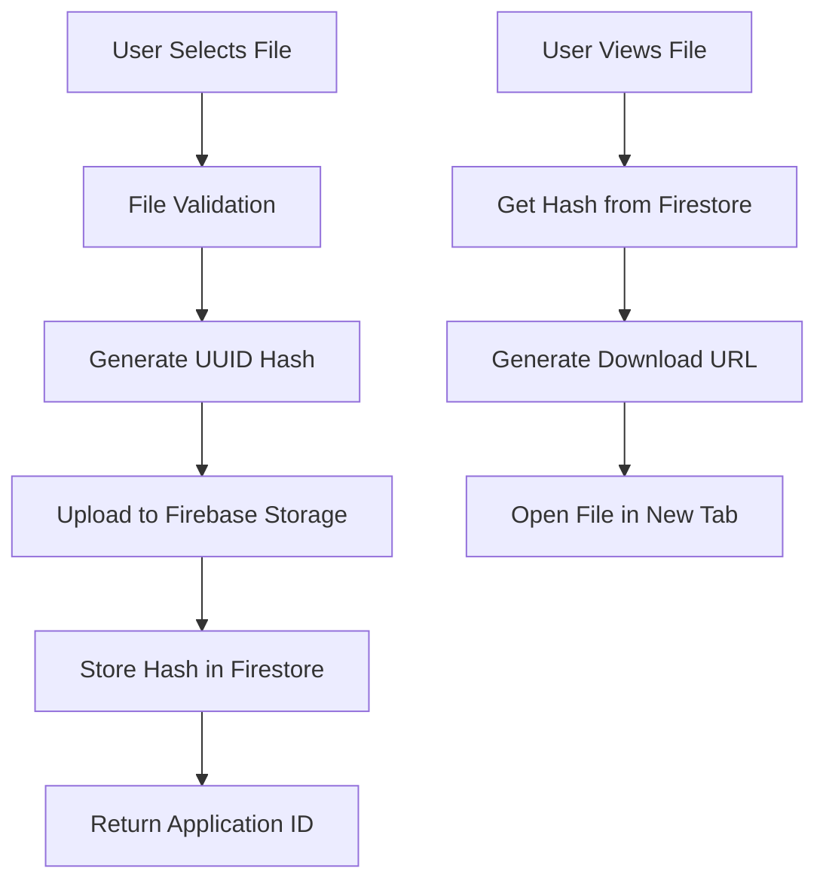
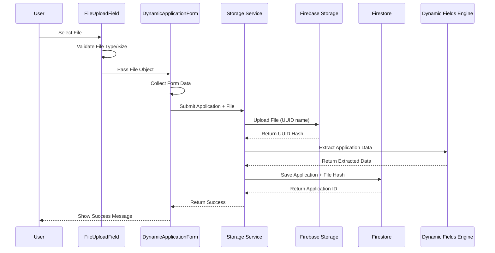
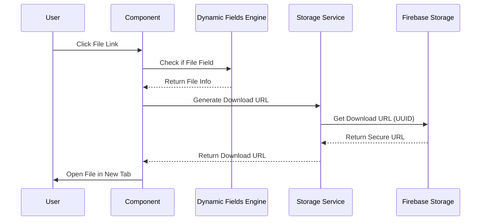

# Dynamic Fields Engine & File Upload System

## Overview

This document explains how the Dynamic Fields Engine works and how file uploads are handled in the Children's Cancer Foundation application system. The system is designed to be completely dynamic, eliminating hardcoded field references and providing a robust file storage solution.

## Table of Contents

1. [Dynamic Fields Engine](#dynamic-fields-engine)
2. [File Upload System](#file-upload-system)
3. [Data Flow Architecture](#data-flow-architecture)
4. [Implementation Examples](#implementation-examples)
5. [Security Considerations](#security-considerations)
6. [Troubleshooting](#troubleshooting)

---

## Dynamic Fields Engine

### What is the Dynamic Fields Engine?

The Dynamic Fields Engine is a centralized service that provides a single source of truth for managing dynamic form fields across the entire application. It eliminates hardcoded field references and ensures all components can dynamically discover, filter, and render form fields based on the actual form templates in the database.

### Key Components

#### 1. Core Engine (`dynamic-fields-engine.ts`)

```typescript
export class DynamicFieldsEngine {
    private static instance: DynamicFieldsEngine;
    private fieldCache: Map<string, FieldInfo> = new Map();
    private lastCacheUpdate: number = 0;
    private readonly CACHE_DURATION = 5 * 60 * 1000; // 5 minutes
}
```

**Features:**
- **Singleton Pattern**: Single instance shared across the entire application
- **Intelligent Caching**: 5-minute cache to avoid repeated API calls
- **Type Safety**: Full TypeScript support with `FieldInfo` interface
- **Comprehensive Filtering**: Filter by grant types, field types, search queries

#### 2. Field Information Structure

```typescript
export interface FieldInfo {
    id: string;                    // Unique field identifier
    label: string;                 // Human-readable field name
    type: string;                  // Field type (text, file, number, etc.)
    grantTypes: string[];          // Grant types this field applies to
    isRequired?: boolean;          // Whether field is required
    helpText?: string;             // Help text for the field
    options?: string[];            // Options for select fields
}
```

### How It Works

#### 1. Field Discovery Process



**Step-by-Step Process:**

1. **Cache Check**: Engine first checks if cached data is still valid (within 5 minutes)
2. **Template Fetching**: If cache is stale, fetches all form templates from Firestore
3. **Field Extraction**: Iterates through each template's pages and fields
4. **Field Mapping**: Creates a comprehensive map of all unique fields with their metadata
5. **Cache Update**: Stores the field map in memory for future requests

#### 2. Field Filtering

The engine provides multiple filtering options:

```typescript
const options: FieldFilterOptions = {
    grantTypes: ['research', 'nextgen'],     // Filter by grant types
    fieldTypes: ['file', 'text'],            // Filter by field types
    excludeFields: ['internal_notes'],       // Exclude specific fields
    includeFields: ['proposal_pdf'],         // Include only specific fields
    searchQuery: 'proposal'                  // Search by label or ID
};

const filteredFields = await dynamicFieldsEngine.getFilteredFields(options);
```

#### 3. Data Extraction

The engine provides dynamic data extraction that replaces hardcoded field mappings:

```typescript
// Before (Hardcoded)
const extracted = {
    name: getValue('principal_investigator', ['principalInvestigator', 'name']),
    institution: getValue('institution_name', ['institution']),
    // ... many hardcoded mappings
};

// After (Dynamic)
const extracted = dynamicFieldsEngine.extractApplicationData(applicationData, formData);
```

### Usage Examples

#### Administrator Dashboard
```typescript
import { dynamicFieldsEngine } from '../services/dynamic-fields-engine';

const AdminDashboard = () => {
    const [fields, setFields] = useState<Map<string, FieldInfo>>(new Map());
    
    useEffect(() => {
        const loadFields = async () => {
            // Get all fields or filter by grant type
            const allFields = await dynamicFieldsEngine.getAllFields();
            setFields(allFields);
        };
        loadFields();
    }, []);
    
    return (
        <div>
            {Array.from(fields.entries()).map(([fieldId, fieldInfo]) => (
                <div key={fieldId}>
                    <label>{fieldInfo.label}</label>
                    {/* Render field based on type */}
                </div>
            ))}
        </div>
    );
};
```

#### Field Type Detection
```typescript
// Check if a field is a file field
const isFile = dynamicFieldsEngine.isFileField(fieldInfo, value);

// Check if a field is a long text field
const isLongText = dynamicFieldsEngine.isLongTextField(fieldInfo, value);

// Get display name for file fields
const displayName = dynamicFieldsEngine.getFileDisplayName(fileValue);
```

---

## File Upload System

### Architecture Overview

The file upload system uses Firebase Storage for secure file storage and Firestore for metadata storage. Files are stored with UUID-based names for security and uniqueness.



### File Upload Process

#### 1. File Selection and Validation

```typescript
// FileUploadField.tsx
const handleFileSelect = (event: React.ChangeEvent<HTMLInputElement>) => {
    const file = event.target.files?.[0] || null;
    
    if (file) {
        // Validate file type (PDF, Word, Text)
        const allowedTypes = [
            'application/pdf',
            'application/msword',
            'application/vnd.openxmlformats-officedocument.wordprocessingml.document',
            'text/plain'
        ];
        
        if (!allowedTypes.includes(file.type)) {
            alert('Please select a PDF, Word document, or text file only.');
            return;
        }

        // Validate file size (max 10MB)
        const maxSize = 10 * 1024 * 1024; // 10MB
        if (file.size > maxSize) {
            alert('File size must be less than 10MB.');
            return;
        }
    }

    onFileUpload(file);
};
```

#### 2. File Upload to Firebase Storage

```typescript
// storage.ts
export const uploadFileToStorage = async (file: File): Promise<string> => {
    const user = auth.currentUser;
    if (!user) {
        throw new Error('User must be authenticated to upload files');
    }

    // Generate unique UUID for file name
    const name = crypto.randomUUID();
    const storageRef = ref(storage, 'pdfs/' + name);

    try {
        console.log('Uploading file to storage...');
        const snapshot = await uploadBytes(storageRef, file);
        console.log('Uploaded a blob or file!');

        const downloadURL = await getDownloadURL(snapshot.ref);
        console.log('File available at', downloadURL);

        // Return the UUID hash (not the download URL)
        return name;
    } catch (error) {
        console.error('Upload failed', error);
        throw error;
    }
};
```

#### 3. Application Submission with File

```typescript
// dynamic-application-service.ts
export async function submitDynamicApplication(
    formTemplateId: string,
    formData: FormData,
    file: File | null,
    applicantId: string,
    applicationCycle: string
): Promise<string> {
    // Upload file to Firebase Storage if provided
    let uploadedFileName: string | undefined;
    if (file) {
        try {
            uploadedFileName = await uploadFileToStorage(file);
            console.log('File uploaded successfully:', uploadedFileName);
        } catch (uploadError) {
            console.error('File upload failed:', uploadError);
            throw new Error(`File upload failed: ${uploadError.message}`);
        }
    }

    // Clean form data to replace File objects with uploaded file names
    const cleanedFormData = cleanFormDataForFirestore(formData, uploadedFileName);

    // Create application document
    const application: DynamicApplication = {
        applicationId: docRef.id,
        creatorId: applicantId,
        grantType: template.grantType,
        applicationCycle,
        submitTime: now,
        decision: 'pending',
        formTemplateId,
        formVersion: template.version,
        formData: cleanedFormData,  // Contains file hash instead of File object
        isLegacy: false,
        file: uploadedFileName || undefined  // Top-level file reference
    };

    await setDoc(docRef, application);
    return docRef.id;
}
```

### File Storage Structure

#### Firebase Storage Organization
```
Firebase Storage:
├── pdfs/
│   ├── a1b2c3d4-e5f6-7890-abcd-ef1234567890  (actual file content)
│   ├── b2c3d4e5-f6g7-8901-bcde-f23456789012  (actual file content)
│   └── c3d4e5f6-g7h8-9012-cdef-345678901234  (actual file content)
```

#### Firestore Document Structure
```javascript
// Application document in Firestore
{
  applicationId: "app_123",
  creatorId: "user_456",
  grantType: "research",
  formTemplateId: "template_789",
  formVersion: "1.0",
  formData: {
    proposal_pdf: "a1b2c3d4-e5f6-7890-abcd-ef1234567890",  // File hash
    budget_document: "b2c3d4e5-f6g7-8901-bcde-f23456789012", // File hash
    project_title: "Cancer Research Project",
    // ... other form fields
  },
  file: "a1b2c3d4-e5f6-7890-abcd-ef1234567890",  // Primary file reference
  submitTime: "2024-01-15T10:30:00Z",
  decision: "pending"
}
```

### File Retrieval Process

#### 1. File Detection in UI

```typescript
// GrantAwards.tsx
const isFileField = dynamicFieldsEngine.isFileField(fieldInfo, value);

if (isFileField && !isEmpty) {
    const fileName = String(value);
    const displayName = dynamicFieldsEngine.getFileDisplayName(fileName);
    
    return (
        <td key={key} className="cell-with-button">
            <button
                className="file-link-btn"
                onClick={() => handleFileClick(fileName, app.id)}
                title={`Open ${fileName}`}
            >
                📄 {displayName}
            </button>
        </td>
    );
}
```

#### 2. Download URL Generation

```typescript
const generateFileDownloadUrl = async (fileName: string, applicationId: string): Promise<string | null> => {
    try {
        if (!fileName) return null;
        
        // The fileName is actually the hash generated by uploadFileToStorage
        // Files are stored in the 'pdfs/' folder with the hash as the filename
        const filePath = `pdfs/${fileName}`;
        
        try {
            const fileRef = ref(storage, filePath);
            const downloadUrl = await getDownloadURL(fileRef);
            return downloadUrl;
        } catch (error) {
            console.error('Error getting download URL for file:', fileName, error);
            return null;
        }
    } catch (error) {
        console.error('Error generating file download URL:', error);
        return null;
    }
};
```

#### 3. File Opening

```typescript
const handleFileClick = async (fileName: string, applicationId: string) => {
    try {
        const downloadUrl = await generateFileDownloadUrl(fileName, applicationId);
        if (downloadUrl) {
            window.open(downloadUrl, '_blank');
        } else {
            alert('File not found or unable to generate download link');
        }
    } catch (error) {
        console.error('Error opening file:', error);
        alert('Error opening file');
    }
};
```

### PDF Generation with File Links

The PDF generation system pre-generates download URLs for all file fields:

```typescript
const generatePDF = async (application: GrantAwardApplication) => {
    // Pre-generate download URLs for file fields
    const fileDownloadUrls: Record<string, string> = {};
    
    for (const [key, fieldInfo] of Array.from(getFilteredFields().entries())) {
        const value = (application as any)[key];
        if (value && /* other conditions */) {
            const isFileField = dynamicFieldsEngine.isFileField(fieldInfo, value);
            
            if (isFileField) {
                try {
                    const downloadUrl = await generateFileDownloadUrl(String(value), application.id);
                    if (downloadUrl) {
                        fileDownloadUrls[key] = downloadUrl;
                    }
                } catch (error) {
                    console.error('Error generating download URL for field:', key, error);
                }
            }
        }
    }

    // Generate HTML with direct download links
    const htmlContent = `
        <div class="field">
            <div class="field-label">${fieldInfo.label}:</div>
            <div class="field-value">
                <a href="${downloadUrl}" target="_blank" class="file-link">
                    📄 ${displayName}
                </a>
            </div>
        </div>
    `;
};
```

---

## Data Flow Architecture

### Complete Application Submission Flow



### File Retrieval Flow



---

## Implementation Examples

### 1. Administrator Dashboard Integration

```typescript
import { dynamicFieldsEngine } from '../services/dynamic-fields-engine';

const AdminDashboard = () => {
    const [fields, setFields] = useState<Map<string, FieldInfo>>(new Map());
    const [applications, setApplications] = useState<Application[]>([]);
    
    useEffect(() => {
        const loadData = async () => {
            // Load fields dynamically
            const allFields = await dynamicFieldsEngine.getAllFields();
            setFields(allFields);
            
            // Load applications
            const apps = await fetchApplications();
            setApplications(apps);
        };
        loadData();
    }, []);
    
    const renderApplicationData = (app: Application) => {
        const extractedData = dynamicFieldsEngine.extractApplicationData(app, app.formData);
        
        return Array.from(fields.entries()).map(([fieldId, fieldInfo]) => {
            const value = extractedData[fieldId];
            if (!value) return null;
            
            const isFile = dynamicFieldsEngine.isFileField(fieldInfo, value);
            const isLongText = dynamicFieldsEngine.isLongTextField(fieldInfo, value);
            
            return (
                <div key={fieldId} className="field-row">
                    <label>{fieldInfo.label}:</label>
                    {isFile ? (
                        <FileDisplay value={value} applicationId={app.id} />
                    ) : isLongText ? (
                        <LongTextDisplay value={value} label={fieldInfo.label} />
                    ) : (
                        <span>{String(value)}</span>
                    )}
                </div>
            );
        });
    };
    
    return (
        <div>
            {applications.map(app => (
                <div key={app.id} className="application-card">
                    {renderApplicationData(app)}
                </div>
            ))}
        </div>
    );
};
```

### 2. File Display Component

```typescript
interface FileDisplayProps {
    value: string;
    applicationId: string;
}

const FileDisplay: React.FC<FileDisplayProps> = ({ value, applicationId }) => {
    const [isLoading, setIsLoading] = useState(false);
    
    const handleFileClick = async () => {
        setIsLoading(true);
        try {
            const downloadUrl = await generateFileDownloadUrl(value, applicationId);
            if (downloadUrl) {
                window.open(downloadUrl, '_blank');
            } else {
                alert('File not found or unable to generate download link');
            }
        } catch (error) {
            console.error('Error opening file:', error);
            alert('Error opening file');
        } finally {
            setIsLoading(false);
        }
    };
    
    const displayName = dynamicFieldsEngine.getFileDisplayName(value);
    
    return (
        <button
            className="file-link-btn"
            onClick={handleFileClick}
            disabled={isLoading}
            title={`Open ${value}`}
        >
            {isLoading ? '⏳' : '📄'} {displayName}
        </button>
    );
};
```

### 3. Modal Integration

```typescript
import { useModalFields, getApplicationFieldData } from '../services/dynamic-fields-usage-examples';

const ApplicationModal: React.FC<{ application: Application; grantType: string }> = ({ 
    application, 
    grantType 
}) => {
    const [fields, setFields] = useState<Map<string, FieldInfo>>(new Map());
    
    useEffect(() => {
        const loadFields = async () => {
            const modalFields = await useModalFields({
                grantTypes: [grantType],
                excludeFields: ['internal_notes', 'admin_comments']
            });
            setFields(modalFields);
        };
        loadFields();
    }, [grantType]);
    
    const fieldData = getApplicationFieldData(application, fields);
    
    return (
        <div className="modal-content">
            <h2>Application Details</h2>
            {fieldData.map(({ fieldId, fieldInfo, value, isFile, isLongText, displayName }) => (
                <div key={fieldId} className="field-row">
                    <label className="field-label">{fieldInfo.label}:</label>
                    <div className="field-value">
                        {isFile ? (
                            <FileDisplay value={value} applicationId={application.id} />
                        ) : isLongText ? (
                            <LongTextDisplay value={value} label={fieldInfo.label} />
                        ) : (
                            <span>{String(value)}</span>
                        )}
                    </div>
                </div>
            ))}
        </div>
    );
};
```

---

## Security Considerations

### File Upload Security

1. **File Type Validation**: Only allows specific file types (PDF, Word, Text)
2. **File Size Limits**: Maximum 10MB per file
3. **UUID Naming**: Files are stored with random UUIDs, preventing direct access
4. **Authentication Required**: Users must be authenticated to upload files
5. **Secure URLs**: Download URLs are generated dynamically and are temporary

### Data Security

1. **No Hardcoded Fields**: All field information comes from the database
2. **Dynamic Validation**: Field validation is based on form templates
3. **Access Control**: File access is controlled through Firebase Security Rules
4. **Audit Trail**: All file operations are logged

### Firebase Security Rules

```javascript
// storage.rules
rules_version = '2';
service firebase.storage {
  match /b/{bucket}/o {
    // Allow authenticated users to upload files
    match /pdfs/{fileName} {
      allow read, write: if request.auth != null;
    }
  }
}
```

---

## Troubleshooting

### Common Issues

#### 1. File Upload Failures

**Problem**: Files fail to upload
**Solutions**:
- Check file size (must be < 10MB)
- Verify file type is supported
- Ensure user is authenticated
- Check Firebase Storage rules

#### 2. File Not Found Errors

**Problem**: 404 errors when trying to access files
**Solutions**:
- Verify file hash is stored correctly in Firestore
- Check if file exists in Firebase Storage
- Ensure download URL generation is working
- Verify Firebase Storage rules allow access

#### 3. Dynamic Fields Not Loading

**Problem**: Fields not appearing in UI
**Solutions**:
- Check if form templates exist in Firestore
- Verify cache is not stale (clear cache if needed)
- Ensure proper error handling in field discovery
- Check network connectivity to Firebase

#### 4. TypeScript Compilation Errors

**Problem**: Map iteration errors
**Solutions**:
- Use `Array.from(map.entries())` instead of direct iteration
- Ensure proper type annotations
- Check TypeScript target version

### Debugging Tools

#### Cache Management
```typescript
// Clear cache when form templates are updated
dynamicFieldsEngine.clearCache();

// Check cache status
const stats = dynamicFieldsEngine.getCacheStats();
console.log(`Cache size: ${stats.size}, Last update: ${stats.lastUpdate}, Is stale: ${stats.isStale}`);
```

#### File Debugging
```typescript
// Check if file exists
const fileRef = ref(storage, `pdfs/${fileHash}`);
try {
    const downloadUrl = await getDownloadURL(fileRef);
    console.log('File exists:', downloadUrl);
} catch (error) {
    console.error('File not found:', error);
}
```

#### Field Discovery Debugging
```typescript
// Get all available grant types
const grantTypes = await dynamicFieldsEngine.getAvailableGrantTypes();
console.log('Available grant types:', grantTypes);

// Get all available field types
const fieldTypes = await dynamicFieldsEngine.getAvailableFieldTypes();
console.log('Available field types:', fieldTypes);

// Search for specific fields
const searchResults = await dynamicFieldsEngine.searchFields('proposal');
console.log('Search results:', searchResults);
```

---

## Best Practices

### 1. Always Use the Engine
- Don't hardcode field names or types
- Use `dynamicFieldsEngine.extractApplicationData()` for data extraction
- Use engine methods for field type detection

### 2. Handle Errors Gracefully
- Wrap all engine calls in try-catch blocks
- Provide fallback behavior for failed operations
- Log errors for debugging

### 3. Cache Management
- Let the engine handle caching automatically
- Clear cache when form templates are updated
- Monitor cache performance

### 4. File Handling
- Always validate files before upload
- Use UUID-based naming for security
- Generate download URLs dynamically
- Handle file access errors gracefully

### 5. Performance Optimization
- Use filtering options to get only needed fields
- Pre-generate download URLs for PDF reports
- Implement proper loading states

---

## Conclusion

The Dynamic Fields Engine and File Upload System provide a robust, scalable solution for managing dynamic form fields and file uploads. The system eliminates hardcoded references, provides type safety, and ensures secure file handling. By following the patterns and examples in this document, developers can easily integrate dynamic field functionality into any component of the application.

The system is designed to be:
- **Dynamic**: Adapts to any form template structure
- **Secure**: Proper file validation and access control
- **Performant**: Intelligent caching and efficient data handling
- **Maintainable**: Clear separation of concerns and comprehensive documentation
- **Type-Safe**: Full TypeScript support with proper interfaces

For additional support or questions, refer to the usage examples in `dynamic-fields-usage-examples.ts` or the comprehensive documentation in `README-DynamicFieldsEngine.md`.


